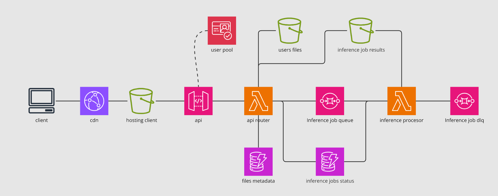

# AI File Processing API

This project is an AWS-based serverless API that allows users to upload files, create inference jobs on the uploaded files, and download the processed results. The API is built using AWS Lambda functions, API Gateway, DynamoDB, S3, and SQS services.

## Architecture

The architecture consists of the following components:

1. **API Gateway**: Provides the RESTful API endpoints for the application.
2. **API Lambda Function**: Handles user authentication, file uploads, file management, and job creation.
3. **DynamoDB Tables**:
   - **Metadata Table**: Stores metadata about the uploaded files, including file ID, filename, size, and user ID.
   - **Inference Jobs Table**: Stores information about the inference jobs, including job ID, status, input files, and error messages (if any).
4. **S3 Buckets**:
   - **Input Bucket**: Stores the uploaded files.
   - **Output Bucket**: Stores the processed files (results of the inference jobs).
5. **SQS Queue**: Handles the inference job requests.
6. **Inference Lambda Function**: Processes the inference jobs by calling the Bedrock AI API and storing the results in the Output Bucket.

## API Endpoints

### `GET /files`

Lists all the files uploaded by the authenticated user.

### `POST /files`

Uploads a new file to the user's space. The file content should be base64-encoded and sent in the request body.

### `DELETE /files/{file_id}`

Deletes the specified file from the user's space.

### `POST /jobs`

Creates a new inference job for the authenticated user. The request body should contain a list of file IDs and a prompt for the AI model.

### `GET /jobs`

Lists all the inference jobs created by the authenticated user, along with their status and other details.

### `GET /jobs/{job_id}/download/{file_id}`

Generates a pre-signed URL for downloading the processed file from the specified job and file ID.

## Deployment

The project is deployed using AWS CloudFormation and the Serverless Application Model (SAM). The deployment process includes creating the necessary AWS resources (Lambda functions, API Gateway, DynamoDB tables, S3 buckets, and SQS queue) and configuring the appropriate permissions and event triggers.

This diagram shows the interactions between the different components of the application, including the user, API Gateway, Lambda functions, DynamoDB tables, S3 buckets, SQS queue, and the Bedrock AI API.

The flow starts with the user uploading a file through the API Gateway, which triggers the API Lambda function to store the file metadata in DynamoDB and upload the file to the S3 Input Bucket. The user then creates an inference job, which is processed by the API Lambda function, and the job request is sent to the SQS queue.

The Inference Lambda function is triggered by the SQS queue, retrieves the input files from the S3 Input Bucket, calls the Bedrock AI API for processing, and stores the processed files in the S3 Output Bucket. The job status is updated in the DynamoDB Jobs table at various stages.

The user can then check the job status and download the processed files through the API Gateway, which interacts with the API Lambda function to retrieve the necessary information from DynamoDB and generate a pre-signed URL for the file download from the S3 Output Bucket.

